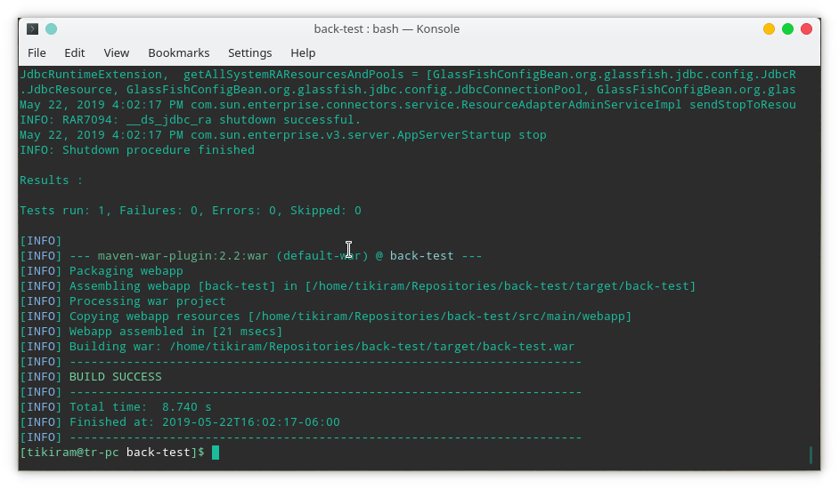
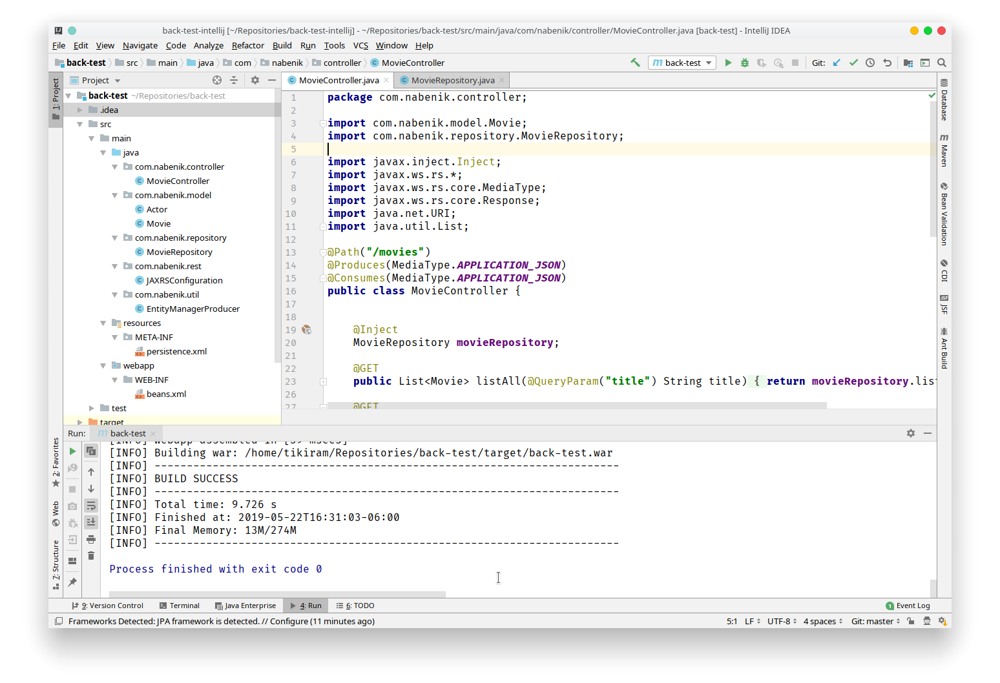
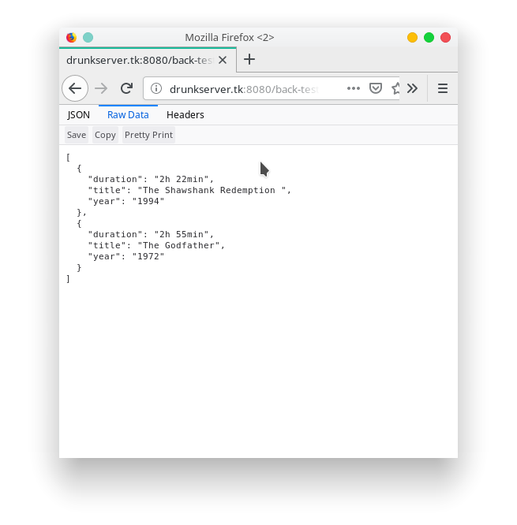
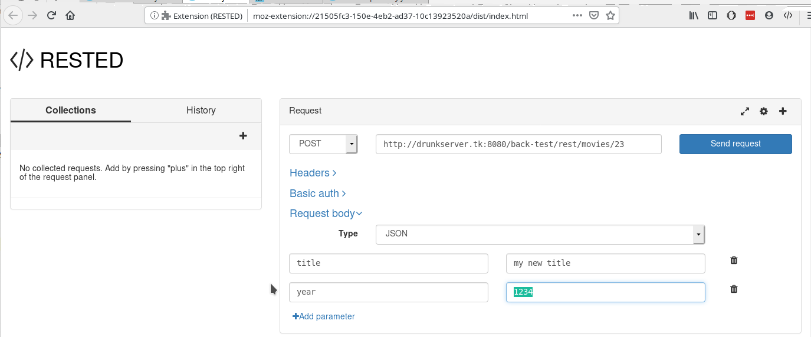

# Nabenik's Java EE basic test

Hi and welcome to this test. As many technical interviews, main test objective is to determine your actual EE skill, being:

- General Java knowledge
- General toolkits, SDK's and other usages
- Java EE general skills

To complete this test, please create a fork of this repository, commit the solutions/answers to YOUR copy and finally do a pull request to the original repo.

The document is structured using [GitHub Markdown Flavor](https://github.com/adam-p/markdown-here/wiki/Markdown-Cheatsheet#code).

## General questions

1. How should you answer these questions?

> Like this

Or maybe with code

```kotlin
fun hello() = "world"
```

2. Please enumerate al least 3 Java EE APIs being used at this project, also define it's main objective

    + javax.ws.rs
    
        > High-level interfaces and annotations used to create RESTful service resources.
    
    * javax.persistence
    
        >Java Persistence is the API for the management for persistence and object/relational mapping.
        
    * javax.inject
    
        > This package specifies a means for obtaining objects in such a way as to maximize reusability, testability and maintainability compared to traditional approaches such as constructors, factories, and service locators (e.g., JNDI). This process, known as dependency injection, is beneficial to most nontrivial applications.     


3. Which of the following is not an application server?

* ~~Tomcat~~ Web Container
* ~~Undertow~~ Web Server
* ~~Grizzly~~ Framework
* ~~Netty~~ Framework

4. This project defines two main profiles. Which one will be the default if -P argument is not used on Maven?

Using this command we cant list all the profiles

```bash
mvn help:all-profiles
```
In the output we can see the active one.

`arquillian-payara-embedded` (**Active: true**, Source: pom)


5. Could you guess if this project will be supported on many application servers? Which ones? Why is this possible?

    Any application server. (I do not see a specific dependency towards a specific application server)

6. If no database is configured? Will you be able to run this project? Why?

    Yes, the application process do not rely on a database connection although it not gonna be able to query the database.

## Development tasks

1. (easy) Please include a screenshot of this project building on a regular CLI

We use the `package` command to generate the `war` file.

```bash
mvn package
```




2. (easy) Please include a screenshot of this project running on an IDE of your choice

    Using Intellij IDEA
    
    


3. (medium) Please deploy this project to a compatible application server, later include the screenshot of the list Movies endpoint

    
    
    Deployed with the JBoss cli:
    
    ```bash
    deploy /home/tikiram_samaneb/back-test/target/back-test.war
    ```
    
    Compute engine instance configured with wildfly:  [http://drunkserver.tk:8080/back-test/rest/movies](http://drunkserver.tk:8080/back-test/rest/movies)
    
    Added some movies to an object list in the movie controller (**no database used**).

3. (medium) Include a screenshot of each of the endpoint operations, if needed please also check/fix the code

    We can use a REST client like RESTED for Firefox with the different HTTP methods to check the different endpoint operations. The project needs a database so I gonna end the test here.



4. (medium) Add support to Bean Validation for the entity Movie and validate nulls on REST layer

5. (hard) Please identify the Integration Testing for `MovieRepository`, after that implement each of the non-included CRUD methods

6. (hard) This project includes support for [Oracle Weblogic](https://www.oracle.com/technetwork/middleware/weblogic/downloads/wls-main-097127.html), please include a screenshot with your modifications being tested with Weblogic 